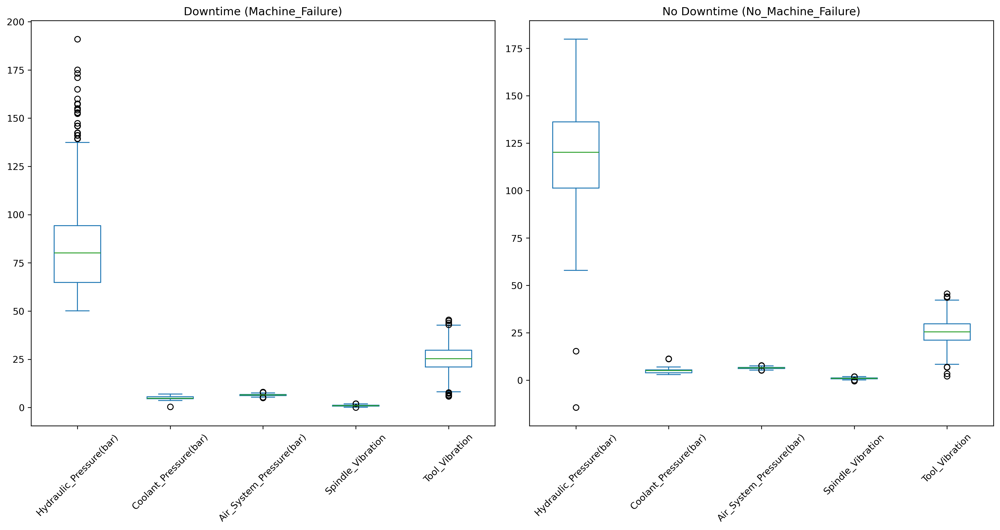
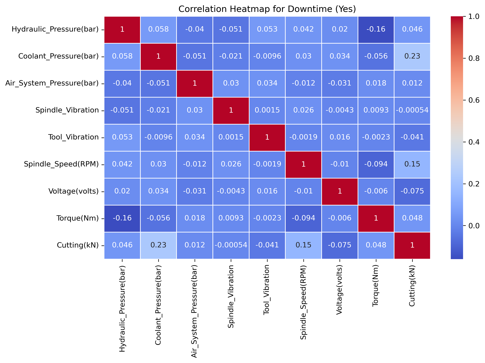

# Table of Contents

1. [Introduction](#introduction)
2. [Executive Summary](#executive-summary)
3. [Descriptive Analysis](#descriptive-analysis)
    1. [Full Dataset Overview](#full-dataset-overview)
    2. [Downtime Dataset Overview](#downtime-dataset-overview)
4. [Boxplot Analysis: Downtime vs. No Downtime](#boxplot-analysis-downtime-vs-no-downtime)
5. [Heatmap Analysis: Correlations Between Metrics](#heatmap-analysis-correlations-between-metrics)
6. [Hypothesis Testing](#hypothesis-testing)
7. [Detailed Machine Learning Report](#detailed-machine-learning-report)
    1. [Data Preprocessing and Feature Engineering](#data-preprocessing-and-feature-engineering)
    2. [Model Evaluation](#model-evaluation)
    3. [Overall vs. Machine-Specific Models](#overall-vs-machine-specific-models)
    4. [Key Insights](#key-insights)
8. [General Recommendations](#general-recommendations)
9. [Machine Learning Model Recommendations](#machine-learning-model-recommendations)

#  Data Description

The following table describes the columns in the machine operating data:

| **Column Name**             | **Data Type**   | **Category**                  |
|-----------------------------|-----------------|-------------------------------|
| `Date`                      | datetime64[ns]  | Date/Time (Timestamp of the reading) |
| `Machine_ID`                | text            | Identifier (Machine Identifier)     |
| `Assembly_Line_No`          | text            | Identifier (Assembly Line Identifier) |
| `Hydraulic_Pressure(bar)`   | decimal         | Pressure (Hydraulic Pressure)       |
| `Coolant_Pressure(bar)`     | decimal         | Pressure (Coolant Pressure)         |
| `Air_System_Pressure(bar)`  | decimal         | Pressure (Air System Pressure)      |
| `Coolant_Temperature`       | decimal         | Temperature (Coolant Temperature)   |
| `Hydraulic_Oil_Temperature` | decimal         | Temperature (Hydraulic Oil Temperature) |
| `Spindle_Bearing_Temperature` | decimal    | Temperature (Spindle Bearing Temperature) |
| `Spindle_Vibration`         | decimal         | Vibration (Spindle Vibration)       |
| `Tool_Vibration`            | decimal         | Vibration (Tool Vibration)          |
| `Spindle_Speed(RPM)`        | decimal         | Speed (Spindle Rotational Speed)    |
| `Voltage(volts)`            | decimal         | Electrical (Machine Voltage)        |
| `Torque(Nm)`                | decimal         | Force (Machine Torque)              |
| `Cutting(kN)`               | decimal         | Force (Cutting Force)               |
| `Downtime`                  | text            | Indicator (Machine Downtime)        |

---

# Introduction

This report provides a comprehensive analysis of the dataset containing sensor readings from industrial machinery. The focus is on summarizing key metrics and identifying patterns under two scenarios: Full Dataset (all operational periods) and Downtime Dataset (specific to machinery downtime). A predictive model has also been developed for integration with real-time operational data to detect potential machine failures.

---

# Executive Summary

The analysis of machine operational data offers critical insights into factors influencing machine downtime and failure:

- Hydraulic pressure levels are lower during downtime, combined with higher spindle speeds and coolant temperatures, indicating pressure issues and overheating contribute to machine failure.
- Elevated torque and cutting forces during downtime suggest operational stress or resistance buildup, worsening machine performance.
- Regular tracking of hydraulic pressure, coolant temperature, spindle bearing conditions, and tool vibrations is essential for proactive failure prevention.

### Key Findings:
- **Top Features**: `Hydraulic_Pressure(bar)`, `Torque(Nm)`, and `Cutting(kN)` consistently ranked as key predictors across models.
- **Best Model**: Random Forest performed exceptionally well with an F1 score and accuracy of **0.992**, showing excellent precision and recall for both downtime and non-downtime periods.
- **Machine-Specific Models**: These models showed strong performance (F1 scores above 0.96), but the overall model maintained competitive accuracy, proving robust across various machines.
- **Feature Engineering**: Derived features like `Pressure_Diff`, `Pressure_Temp_Interaction`, and rolling statistics improved accuracy by capturing complex operational behaviors.

An independent t-test comparing hydraulic pressure during downtime versus operational periods found significant differences:
- **T-statistic**: -33.56
- **P-value**: 5.31e-204
- **Conclusion**: The null hypothesis was rejected, confirming hydraulic pressure is significantly lower during downtime.

---

## Descriptive Analysis

### Full Dataset Overview

The full dataset includes 2,500 entries, capturing a range of sensor readings such as hydraulic pressure, coolant temperature, spindle vibration, and tool vibration. Key statistical measures are summarized below.

| **Parameter**                | **Count** | **Mean** | **Min** | **25%** | **50%** | **75%** | **Max** | **Std Dev** |
|------------------------------|-----------|----------|---------|---------|---------|---------|----------|-------------|
| Date                         | 2500      | 2022-03-13 05:57:42 | 2021-11-24 | 2022-02-22 | 2022-03-14 | 2022-04-02 | 2022-07-03 | N/A         |
| Hydraulic_Pressure (bar)     | 2490      | 101.41   | -14.33  | 76.36   | 96.76   | 126.42  | 191.00   | 30.29       |
| Coolant_Pressure (bar)       | 2481      | 4.95     | 0.33    | 4.46    | 4.94    | 5.52    | 11.35    | 0.997       |
| Air_System_Pressure (bar)    | 2483      | 6.50     | 5.06    | 6.22    | 6.51    | 6.78    | 7.97    | 0.407       |
| Coolant_Temperature (°C)     | 2488      | 18.56    | 4.10    | 10.40   | 21.20   | 25.60   | 98.20    | 8.55        |
| Hydraulic_Oil_Temperature (°C)| 2484      | 47.62    | 35.20   | 45.10   | 47.70   | 50.10   | 61.40    | 3.77        |
| Spindle_Bearing_Temperature (°C) | 2493 | 35.06    | 22.60   | 32.50   | 35.10   | 37.60   | 49.50    | 3.76        |
| Spindle_Vibration            | 2489      | 1.01     | -0.46   | 0.78    | 1.01    | 1.24    | 2.00    | 0.343       |
| Tool_Vibration               | 2489      | 25.41    | 2.16    | 21.09   | 25.46   | 29.79   | 45.73    | 6.44        |
| Spindle_Speed (RPM)          | 2494      | 20,274.79| 0.00    | 17,919.00| 20,137.50| 22,501.75| 27,957.00| 3,852.66    |
| Voltage (volts)              | 2494      | 348.99   | 202.00  | 319.00  | 349.00  | 380.00  | 479.00   | 45.38       |
| Torque (Nm)                  | 2479      | 25.23    | 0.00    | 21.67   | 24.65   | 30.51   | 55.55    | 6.14        |
| Cutting (kN)                 | 2493      | 2.78     | 1.80    | 2.25    | 2.78    | 3.27    | 3.93    | 0.62        |

#### Key Observations:
- Hydraulic pressure displays significant variability (std dev of 30.29), with anomalously low values, possibly indicating sensor errors or operational issues.
- Coolant pressure remains stable across operations, with a mean of 4.95 bar and low variability (std dev of 0.997).
- Spindle speed has a mean RPM of 20,275, with large fluctuations (std dev of 3,852), reflecting diverse machine load conditions.
- Voltage shows variability, with a wide range (202–479 volts), possibly due to inconsistent power supply.

### Downtime Dataset Overview

The downtime dataset focuses exclusively on periods of machine failures, capturing 1,265 entries for various parameters.

| **Parameter**                | **Count** | **Mean** | **Min** | **25%** | **50%** | **75%** | **Max** | **Std Dev** |
|------------------------------|-----------|----------|---------|---------|---------|---------|----------|-------------|
| Hydraulic_Pressure (bar)     | 1264      | 84.76    | 50.14   | 64.80   | 80.13   | 94.29   | 191.00   | 26.34       |
| Coolant_Pressure (bar)       | 1265      | 5.11     | 0.33    | 4.55    | 4.79    | 5.57    | 6.96    | 0.92        |
| Air_System_Pressure (bar)    | 1257      | 6.50     | 5.06    | 6.23    | 6.51    | 6.78    | 7.97    | 0.40        |
| Coolant_Temperature (°C)     | 1265      | 19.98    | 4.10    | 12.30   | 23.00   | 26.50   | 36.50    | 8.38        |
| Hydraulic_Oil_Temperature (°C)| 1260      | 47.57    | 35.20   | 45.10   | 47.60   | 50.10   | 59.50    | 3.79        |
| Spindle_Bearing_Temperature (°C) | 1263 | 34.99    | 23.20   | 32.40   | 35.00   | 37.60   | 49.50    | 3.83        |
| Spindle_Vibration            | 1261      | 1.00     | 0.03    | 0.78    | 0.99    | 1.24    | 2.00    | 0.35        |
| Tool_Vibration               | 1259      | 25.37    | 5.78    | 21.06   | 25.33   | 29.75   | 45.49    | 6.50        |
| Spindle_Speed (RPM)          | 1265      | 21,319.36| 0.00    | 18,461.00| 19,964.00| 25,528.00| 27,957.00| 4,123.21    |
| Voltage (volts)              | 1265      | 349.26   | 202.00  | 319.00  | 348.00  | 380.00  | 473.00   | 45.32       |
| Torque (Nm)                  | 1256      | 22.76    | 0.00    | 16.96   | 24.63   | 26.32   | 36.25    | 5.21        |
| Cutting (kN)                 | 1263      | 3.06     | 1.80    | 2.55    | 2.84    | 3.59    | 3.93    | 0.57        |

#### Key Observations:
- Hydraulic pressure is lower during downtime (mean 84.76 bar) with slightly reduced variability compared to the full dataset.
- Coolant temperature is higher during downtime (mean 19.98°C).
- Torque and cutting values are reduced during downtime.

---

## Boxplot Analysis: Downtime vs. No Downtime

Boxplots compare the distribution of numeric features for machines that experienced downtime versus those that did not.

### Key Insights from the Boxplots

#### Overall Trends
Boxplots reveal distinct patterns across pressure, temperature, and vibration features between downtime and no-downtime cases. Several features demonstrate variability or deviations that may serve as indicators for machine failures.

#### Pressure Variables
- **Hydraulic Pressure**: Machines experiencing downtime show wider ranges and more outliers, suggesting instability or fluctuations as potential indicators of machine failure.
- **Coolant Pressure and Air System Pressure**: Deviations during downtime indicate maintaining stable pressure levels is critical for avoiding machine failures.

#### Temperature Variables
- **Coolant and Hydraulic Oil Temperatures**: Downtime scenarios exhibit higher medians and more outliers, implying overheating correlates with machine failures.
- **Spindle Bearing Temperature**: Elevated temperatures during downtime suggest mechanical stress, making this a key parameter for predictive maintenance.

#### Vibration Variables
- **Spindle and Tool Vibration**: Higher variability in vibration levels during downtime indicates potential misalignments, wear, or mechanical inefficiencies.

#### Other Features
- **Spindle Speed**: Erratic or reduced spindle speeds during downtime highlight possible mechanical inefficiencies.
- **Voltage and Torque**: Lower voltage or torque values in downtime cases may indicate electrical or mechanical strain.
- **Cutting Force**: Unstable cutting forces during downtime are indicative of tool wear or operational inefficiency.

---

## Heatmap Analysis: Correlations Between Metrics

Two correlation heatmaps compare relationships between machine metrics under downtime (Yes) and no downtime (No).

### Key Observations

#### Overall Trends
- Correlations across metrics remain generally weak (mostly between -0.1 to 0.2).
- Slight variations in correlation strength distinguish downtime and no-downtime scenarios.

#### Downtime (Yes)
- **Coolant Pressure vs. Cutting Force (0.23)**: Higher coolant pressure correlates with increased cutting force under high-load conditions.
- **Torque vs. Hydraulic Pressure (-0.16)**: Negative correlation suggests hydraulic systems are under strain during high torque operations.
- **Spindle Speed vs. Cutting Force (0.15)**: Positive correlation highlights the importance of stable spindle speeds during cutting operations.

#### No Downtime (No)
- **Spindle Speed vs. Coolant Pressure (0.063)**: Minimal impact of spindle speed on coolant performance.
- **Air System Pressure vs. Torque (0.065)**: Limited dependency between these metrics.
- **Hydraulic Pressure vs. Cutting Force (0.028)**: Stable hydraulic pressure under normal cutting conditions.

#### Comparative Insights
- **Coolant Pressure and Cutting Force**: Stronger correlation during downtime (0.23) compared to no downtime (-0.024).
- **Torque and Hydraulic Pressure**: Negative correlation during downtime (-0.16), indicating strain on hydraulic systems under higher torque.

---

## Hypothesis Testing

To test whether hydraulic pressure during downtime is significantly different from when the machine is operational, an independent t-test was performed.

### Step 1: Define the Hypotheses
- **Null Hypothesis (H₀):** There is no significant difference in hydraulic pressure between downtime and no downtime situations.
- **Alternative Hypothesis (H₁):** There is a significant difference in hydraulic pressure between downtime and no downtime situations.

### Step 2: Results
- **T-statistic:** -33.56
- **P-value:** 5.31e-204

### Interpretation of Results
Since the p-value is much smaller than the threshold of 0.05, we reject the null hypothesis. Therefore, there is a significant difference in hydraulic pressure during downtime compared to when the machine is operational.

---

## Detailed Machine Learning Report

### 1. Data Preprocessing and Feature Engineering
- Variables such as `Machine_ID`, `Assembly_Line_No`, and `Downtime` were converted to categorical codes.
- Derived features included interaction terms, rolling averages, lagged features, flags, cumulative measures, and segmentation.

### 2. Model Evaluation
Three algorithms were evaluated using the top six features ranked by importance.

| **Algorithm**           | **Features Used for Prediction**                     | **F1 Score** | **Accuracy** | **Strengths**                                                                 |
|-------------------------|-----------------------------------------------------|--------------|--------------|------------------------------------------------------------------------------|
| **Random Forest**       | `Cutting(kN)`, `Torque(Nm)`, `Pressure_Diff`, etc.  | 0.992        | 0.992        | High precision and recall, robust against overfitting                        |
| **Gradient Boosting**   | `Hydraulic_Pressure(bar)`, `Torque(Nm)`, etc.       | 0.99         | 0.99         | Comparable to Random Forest, but more resource-intensive                      |
| **Logistic Regression** | `Pressure_Temp_Interaction`, `Spindle_Speed(RPM)`, etc. | 0.808        | 0.808        | Interpretable coefficients, good for understanding feature contributions.    |

### 3. Overall vs. Machine-Specific Models
- **Overall Model**: Achieved strong performance, suggesting it generalizes well across machines.
- **Machine-Specific Models**: F1 scores ranged from 0.9567 to 0.9817, slightly outperforming the overall model for specific machines.

---

# General Recommendations

### 1. Real-time Monitoring of Hydraulic Pressure
- Implement stricter thresholds for hydraulic pressure alerts.
- Significant deviations, especially pressure drops, should trigger early warnings.

### 2. Temperature Management
- Actively monitor coolant and spindle bearing temperatures during high-pressure operations.
- Establishing thresholds for temperature increases can help mitigate overheating issues.

### 3. Predictive Maintenance
- Introduce predictive maintenance algorithms incorporating hydraulic pressure, coolant temperature, and tool vibration data.

### 4. Tool Vibration Control
- Ensure balanced tool operation through continuous vibration monitoring.
- Elevated vibration levels can lead to increased spindle and tool wear.

### 5. Torque Management
- Closely monitor torque levels, particularly during cutting operations.
- Preventing machine overloading helps avoid performance issues.

---

# Machine Learning Model Recommendations

### 1. Separate Machine-Specific Models
- Train separate predictive models for each machine.
- Machines operate under varying conditions, and machine-specific models adapt more effectively.

### 2. Exclusion of Machine ID in Global Models
- Exclude machine IDs from aggregate models used for overall system monitoring.
- Including machine IDs decreases accuracy slightly and increases error rates.

### 3. Focus on Critical Features
- Prioritize the use of key features such as `Cutting(kN)`, `Torque(Nm)`, `Pressure_Diff`, etc., for predictive models.

### 4. Monitor Model Drift for Individual Machines
- Regularly monitor model accuracy for individual machines and recalibrate models when necessary.
